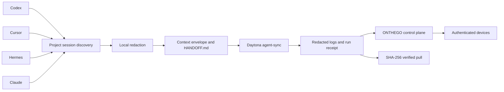

<h1 align="center">ONTHEGO</h1>

<p align="center">
  <strong>Carry the work. Keep the context.</strong>
</p>

<p align="center">
  <em>Secure, project-scoped AI agent handoffs from your local Git workspace to a Daytona sandbox.</em>
</p>

<p align="center">
  
  
  
  
  <a href="LICENSE"></a>
</p>

<p align="center">
  
</p>

Your repository moves easily. Agent memory does not.

ONTHEGO finds the Codex, Cursor, Hermes, and Claude sessions that belong to the current Git project, removes common secrets on your machine, creates a focused handoff, and sends it to an isolated Daytona workload. Run status is synchronized through a lightweight control plane. Results come back only after their SHA-256 digest matches the remote receipt.

```text
local project  ->  redact  ->  HANDOFF.md  ->  Daytona  ->  verify  ->  local result
```

## What It Does

- Discovers every supported agent session associated with the current Git repository.
- Redacts tokens, authorization headers, private keys, and matching secret assignments before transfer.
- Generates a redacted context envelope and human-readable `HANDOFF.md`.
- Starts the default `agent-sync` workload in Daytona with one command.
- Synchronizes run state, redacted logs, and summaries across authenticated devices.
- Uses GPT-5.6 Luna with high reasoning effort to turn current state into a concise status update.
- Downloads an artifact only after its hash matches the remote run receipt.

## Quick Start

Install the CLI:

```bash
npm install -g @jbaehova/onthego
```

Create a private `.env` at the Git root:

```dotenv
DAYTONA_API_KEY=...
ONTHEGO_CONTROL_PLANE_URL=https://your-control-plane.example.com:8443
ONTHEGO_CONTROL_PLANE_TLS_SHA256=...
ONTHEGO_LOGIN_BOOTSTRAP_TOKEN=...

# Optional. Enables the LLM summary in `onthego status`.
OPENAI_API_KEY=...
```

Lock down the file, then run the five-command flow:

```bash
chmod 600 .env

onthego init
onthego login
onthego pass
onthego status
onthego pull
```

That is the complete Phase 1 workflow. You do not choose an agent or paste a session ID. `onthego pass` resolves the current Git root and collects the matching sessions automatically.

> [!NOTE]
> The current release expects a Daytona account and a deployed ONTHEGO control plane. The control plane server is included in this repository. See [Architecture](docs/architecture.md) and the [systemd unit](deploy/contabo/onthego.service).

## The Five Commands

| Command | Purpose |
| --- | --- |
| `onthego init` | Register the current Git repository, create its stable `.onthego.yaml` identity, and add local-only paths to `.gitignore`. |
| `onthego login` | Authenticate this device with the ONTHEGO control plane. |
| `onthego pass` | Collect project sessions, redact them locally, create the handoff, and start `agent-sync` in Daytona. |
| `onthego status` | Refresh the latest Daytona run and redacted logs, synchronize state, and generate a concise summary. |
| `onthego pull` | Download the latest result after receipt and SHA-256 verification. |

Every public command supports schema-versioned JSON output:

```bash
onthego status --json
onthego pull --output ./handoff-result.md --json
```

## How It Works



### 1. Scope by project

ONTHEGO uses the Git root as the trust and discovery boundary. It scans the local storage used by Codex, Cursor, Hermes, and Claude, then keeps only sessions associated with that project.

### 2. Redact before transfer

Raw sessions stay local. Before an envelope leaves the machine, ONTHEGO filters common API keys, bearer tokens, private keys, secret assignments, and opaque encrypted agent payloads. The envelope records source hashes and byte ranges so the handoff remains auditable without exposing local paths.

### 3. Run in isolation

The official Daytona Go SDK creates or selects a sandbox, uploads the redacted context, and starts an ONTHEGO-owned process session. The default CPU-only `agent-sync` workload returns `HANDOFF.md` and can be replaced with a project-defined workload in `.onthego.yaml`.

### 4. Resume with proof

`onthego status` combines local Git state with remote run state. `onthego pull` refuses results with a missing or mismatched SHA-256 receipt, so an unverified artifact never becomes the local handoff.

## Security Model

| Boundary | Protection |
| --- | --- |
| Project | Session discovery is limited to the current Git repository. |
| Secrets | The root `.env` must not be accessible by group or other users and is never tracked. |
| Transfer | Session content is redacted locally before upload. |
| Control plane | TLS is pinned by certificate SHA-256 fingerprint. |
| State | Authenticated generation checks reject stale writes. |
| Results | Remote artifacts are accepted only when their SHA-256 hash matches the receipt. |
| Snapshots | Portable `.otg` snapshots use age X25519 encryption and Ed25519 signatures. |

`onthego init` always keeps `AGENTS.md`, `.agents/`, `.env`, `.onthego.local/`, `HANDOFF.md`, and `*.otg` out of Git. Device login sessions are stored outside the repository with `0600` permissions.

## Project Configuration

`onthego init` creates a safe, trackable `.onthego.yaml`. It contains the project identity and workload policy, never secret values. Re-running `init` preserves the existing project ID.

The default workload is deliberately small:

```yaml
workloads:
  agent-sync:
    kind: agent
    image: debian:bookworm-slim
    gpu_count: 0
    argv:
      - /bin/sh
      - -lc
      - cp ../context/HANDOFF.md ./HANDOFF.md
    output_path: HANDOFF.md
    timeout_seconds: 600
```

The CLI reads `.env` from the current directory up to the Git root. Existing process environment values take precedence over file values. Daytona also accepts `DAYTONA_JWT_TOKEN` as an alternative to `DAYTONA_API_KEY`.

## Platform Support

The npm package currently ships prebuilt binaries for:

- macOS on Apple silicon (`darwin-arm64`)
- Linux on x86-64 (`linux-x64`)

Node.js 18 or newer is required for the npm launcher. Building from source requires Go 1.25.4 or newer.

## Development

```bash
git clone https://github.com/jbaehova/onthego.git
cd onthego
make check
make build
```

Useful project commands:

```bash
make test
./scripts/demo.sh
go run ./cmd/onthego --help
go run ./cmd/onthego-server
```

The release workflow tests and vets the Go code, builds static Linux amd64 and macOS arm64 binaries, scans the npm package for local or secret files, publishes with npm provenance, and attaches checksummed binaries to the GitHub release.

## Repository Layout

```text
cmd/                  CLI and control plane entry points
internal/             capture, redaction, transport, state, and verification
npm/                  cross-platform npm launcher and packaged binaries
deploy/contabo/       hardened systemd service for the control plane
docs/                 architecture, demo, pitch, and progress notes
scripts/              local demo workflow
```

## Roadmap

The five-command agent handoff is the supported Phase 1 contract. GPU fine-tuning, GPU model serving, and Hugging Face model and dataset connectors are active backlog items and are not presented as production features yet.

Follow the implementation record in [docs/progress.md](docs/progress.md).

## License

MIT. See [LICENSE](LICENSE).
