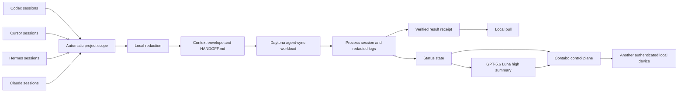

# Phase 1 architecture

The public CLI has five commands: `init`, `login`, `pass`, `pull`, and `status`.

## Local boundary

`onthego init` locates the Git root, creates a stable `.onthego.yaml` project identity, and makes sure local secrets and state are ignored. Other project commands require this marker. A single `onthego pass` command scans Codex, Cursor, Hermes, and Claude storage. It includes every session associated with the current project. Redaction runs before the context envelope leaves the machine. The envelope records each source agent, session, hash, and byte range together with a generated `HANDOFF.md`.

The root `.env` is the only repository file allowed to contain secret values. Its permission must be `0600`. Login tokens are written outside the repository to the operating system user configuration directory.

## Daytona boundary

The Daytona adapter uses the official Go SDK. It creates or selects a sandbox, uploads the context envelope, and uploads the currently installed ONTHEGO binary as the receiver. It starts an ONTHEGO-owned process session and records the sandbox ID, session ID, command ID, timestamps, run state, and artifact hashes.

The default `agent-sync` workload runs without a GPU. Logs are redacted before they are included in local status or synchronized state. Result download rejects paths outside the managed workload root and rejects a file whose SHA-256 hash differs from the remote receipt.

## Control plane boundary

The Contabo service exposes TLS endpoints for login, token refresh, health, and project state. The CLI pins the TLS certificate fingerprint stored in the root `.env`. Access tokens expire after 12 hours and refresh tokens expire after 30 days. Project writes use a generation precondition to reject stale updates.

Synchronized project state contains environment identifiers, Daytona session identifiers, run state, the latest redacted log excerpt, and the latest status summary. It does not contain repository secrets or raw authentication material.

## Status summary

`status` refreshes the latest Daytona receipt and logs, applies redaction, updates synchronized state, and calls the OpenAI Responses API with `gpt-5.6-luna` and reasoning effort `high`. A summary failure is reported without exposing the API key.

## Backlog

GPU fine-tuning, GPU model serving, and Hugging Face model or dataset connectors remain incomplete backlog work. The current Phase 1 does not claim these integrations as production features.
