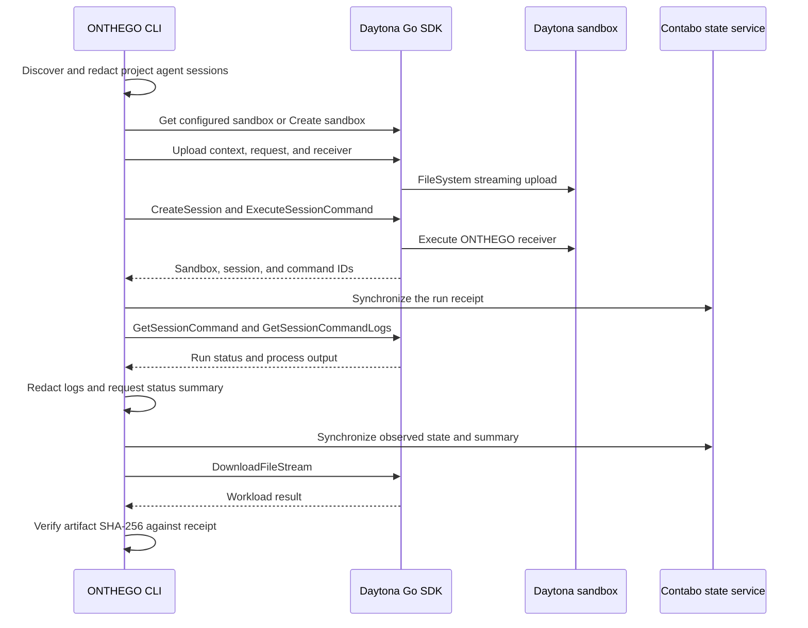

# Daytona integration

Daytona is ONTHEGO's remote execution provider. The CLI hands redacted context to a Daytona sandbox, observes its process session, and retrieves its result. Contabo provides the separate authentication and state service.

This document describes the implementation in this repository. It does not add remote operations or change the five public commands.

## Official Daytona SDK

[`go.mod`](../go.mod) pins `github.com/daytona/clients/sdk-go` at `v0.214.0`. The adapter imports the SDK's `daytona`, `options`, and `types` packages. The generated Daytona API and Toolbox clients are already part of the dependency graph.

```go
import (
    daytonasdk "github.com/daytona/clients/sdk-go/pkg/daytona"
    daytonaoptions "github.com/daytona/clients/sdk-go/pkg/options"
    "github.com/daytona/clients/sdk-go/pkg/types"
)
```

The runtime adapter wraps `*daytonasdk.Client`. It retains the SDK's authentication and transport behavior instead of implementing a separate Daytona HTTP client.

## SDK call map

All calls below are present in [`daytona.go`](../internal/transport/daytona/daytona.go).

| ONTHEGO operation | Official Daytona SDK call | Role |
| --- | --- | --- |
| Client initialization | `daytonasdk.NewClient` | Read Daytona authentication and endpoint settings. |
| Account probe | `Client.List` | Check sandbox listing access without creating a sandbox. |
| Sandbox resolution | `Client.Get` | Reopen the configured sandbox or one referenced by a receipt. |
| Sandbox provisioning | `Client.Create` | Create the workload sandbox with project labels. |
| Remote directories | `FileSystem.CreateFolder` | Prepare metadata, context, and receiver directories. |
| Context and receiver upload | `FileSystem.UploadFileStream` | Stream local files to Daytona. |
| Receiver permissions | `FileSystem.SetFilePermissions` | Make the uploaded Linux receiver executable. |
| Process session creation | `Process.CreateSession` | Allocate an ONTHEGO-owned execution session. |
| Workload launch | `Process.ExecuteSessionCommand` | Start the receiver asynchronously. |
| Execution observation | `Process.GetSessionCommand` | Read the recorded command's exit status. |
| Log collection | `Process.GetSessionCommandLogs` | Retrieve command output for later redaction. |
| Receipt and result retrieval | `FileSystem.DownloadFileStream` | Stream metadata and workload artifacts. |
| Owned session cleanup | `Process.DeleteSession` | Stop an ONTHEGO-prefixed process session. |

## Handoff sequence



## Daytona sandbox configuration

`ensureSandbox` reuses `target.SandboxID` when configured. Otherwise it builds `types.ImageParams` and calls the Daytona SDK's `Create` method.

| Configuration | Current adapter behavior |
| --- | --- |
| Sandbox name | Prefix `onthego-` followed by the transfer identifier prefix. |
| Project ownership | Labels `managed-by=onthego` and `project-id=<project ID>`. |
| Workload image | Use the workload image unless the target overrides it. |
| Lifecycle request | Set `Ephemeral: true` and `AutoDeleteInterval: 0` in the SDK request. |
| Resource request | Forward workload GPU fields; the default profile requests zero GPUs. |
| Secret references | Forward configured secret mappings to Daytona's sandbox configuration. |

The presence of GPU fields does not mean GPU workflows are complete or validated. The supported `agent-sync` profile uses CPU execution.

## Files and process identity

Each transfer uses this layout inside Daytona:

```text
/workspace/onthego/<project-id>/<transfer-id>/
  bin/onthego
  context/
    HANDOFF.md
    context-envelope.json
    ...redacted session files
  metadata/
    workload-request.json
    workload-receipt.json
  workspace/
    HANDOFF.md
```

The process session name begins with `onthego-`. A receipt retains the Daytona sandbox ID, session ID, and command ID so later commands can inspect the same execution.

The receiver writes the result receipt. ONTHEGO compares its transfer ID and request hash with the local request before accepting its artifact metadata. The pull layer then checks the downloaded file's SHA-256.

## Boundaries and supported scope

Local ONTHEGO code owns agent discovery and redaction. Daytona owns the sandbox environment and process execution. The Contabo service synchronizes state. The OpenAI summary consumes observed state and redacted logs.

The default Daytona workload copies `HANDOFF.md` into the result location. It demonstrates context transfer and verified retrieval, not autonomous remote coding. GPU training, GPU model serving, and Hugging Face workflows remain backlog items.

For test commands and fixture details, see [Daytona development](daytona-development.md). For an actual successful Daytona run, see the [VPS follow-up report](testing/2026-09-19-vps-feedback.md).
